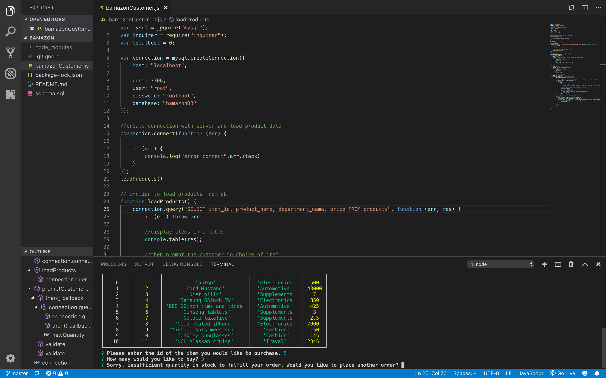

# bamazon

## bamazon is a Node Js app that uses MySQL as the database that drives inventory of an amazon-like store. 

### Technologies used:
1. Node Js
2. MySQL
3. Inquirer npm

## How the app works:
1. The user is initially shown the products available to order.
2. After the products are displayed the user is prompted to choose the id of the item they would like to buy.
3. After an id is inserted the user is then asked how many of the product they would like to buy.
4. The quantity inserted by the user is then checked against the quantity available in stock. If insufficient quantity is determined to fullfill order, the user is given notice of so and given the opportunity to order again or quit the user interface. 
5. If the order proceeds with quantity checked as sufficient the user is then given the total price for the order. The inventory number is adjusted accordingly off the database to reflect the new and accurate inventory quantity. 

